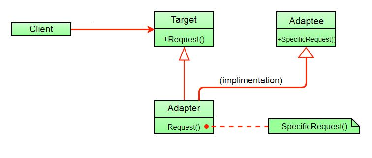

# Adapter Pattern

### 어댑터 패턴
 클래스의 인터페이스를 사용자가 기대하는 다른 인터페이스로 변환하는 패턴으로, 호환성이 없는 인터페이스 때문에 함께 동작할 수 없는 클래스들이 함께 작동하도록 해준다.

UML  
[^1]  

[^1]:https://www.geeksforgeeks.org/adapter-pattern/

  

Target
> 사용자가 원하는 인터페이스 (추상체)

Adaptee
>실제 사용을 원하지만 인터페이스가 다른 클래스 또는 라이브러리

Adapter
> Target과 Adaptee의 인터페이스를 이어주는 어댑터

Client
> 사용자


### 예제
다음 두개의 고성능 정렬 알고리즘에 대한 라이브러리라고 가정해보자.  

각 클래스의 정렬 메소드들은 파라미터와 반환 타입이 다르다. (Adaptee)

```java
public class 한국형_차세대_4차산업혁명_알고리즘 {
	float 쏘트(float value) {
		//complex work
		return 0;
	}
}

public class 中华人民共和国_整洌 {
	double 整列(double value)	{
		//complex work
		return 0d;		
	}
}
```

다음은 사용자가 원하는 정렬에 대한 라이브러리 추상체이다. (Target)

```java
public interface GoodSortLib {
	int goodSort(int value);
}
```

사용자가 中华人民共和国_整洌 클래스의 整列 메소드를 이용하고 싶지만 함수 원형이 달라 사용이 복잡해지고 IDE의 도움이 없다면 한문을 입력하는 것 또한 괴로울 것이다. (Client with non-adapter)

```java
public class Client {
	public static void main(String[] args) {
		int inputData = 1;
	    int outputData;
	    
	   	中华人民共和国_整洌 chnLib = new 中华人民共和国_整洌();
	   	
	   	outputData = (int) chnLib.整列((double)inputData);
	}
}
```

이때 어댑터 패턴을 사용할 수 있다.

GoodSortLib 인터페이스를 구상하는 어댑터 클래스를 만든다. (Adapter)

```java
public class SortAdapter implements GoodSortLib{	
	中华人民共和国_整洌  sortInstance;
	
	public SortAdapter(中华人民共和国_整洌 sortInstance) {
		this.sortInstance = sortInstance;		
	}
	
	@Override
	public int goodSort(int value) {		
		return (int)sortInstance.整列(value);
	}	
}
```

사용자는 다음처럼 사용이 가능하다.

```java
public class Client {
	public static void main(String[] args) {
		int inputData = 1;
	    int outputData;
	    
	    中华人民共和国_整洌 sortLib = new 中华人民共和国_整洌();    	
		GoodSortLib goodLib = new SortAdapter(sortLib);
		
		outputData = goodLib.goodSort(inputData);
	}
}
```

만약 整列()대신 쏘트()를 사용하고 싶다면 다음과 같이 변경하면 된다.

```java
public class SortAdapter implements GoodSortLib{	
	한국형_차세대_4차산업혁명_알고리즘  sortInstance;
	
	public SortAdapter(한국형_차세대_4차산업혁명_알고리즘 sortInstance) {
		this.sortInstance = sortInstance;		
	}
	
	@Override
	public int goodSort(int value) {		
		return (int)sortInstance.쏘트(value);
	}	
}
```

```java
public class Client {
	public static void main(String[] args) {
		int inputData = 1;
	    int outputData;
	    
	   	한국형_차세대_4차산업혁명_알고리즘 sortLib = new 한국형_차세대_4차산업혁명_알고리즘();    	
		GoodSortLib goodLib = new SortAdapter(sortLib);
		
		outputData = goodLib.goodSort(inputData);
	}
}
```


예제에서는 정렬 메소드를 한번만 호출하지만 여러번 호출하게 되었을때, 어댑터 패턴을 적용하지 않았다면 함수 원형의 차이로 모든 메소드 호출을 수정해야 한다.

---

참고문헌

[Head First Design Patterns: 스토리가 있는 패턴 학습법 - 한빛미디어](http://www.hanbit.co.kr/store/books/look.php?p_code=B9860513241)

